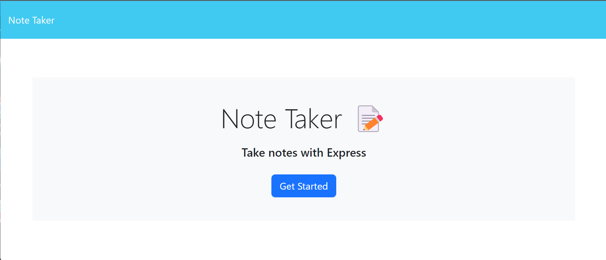

# Note-Taker-C9
  

  ## Description
  
  Note Taker is a simple program meant to write and save notes.
  
  ## Table of Contents
  - [Usage](#usage)
  - [Installation](#installation)
  - [Credits & Contributions](#contributions)
  - [Tests](#tests)
  - [Questions](#questions)
  - [License](#license)

  ## Usage

  Note Taker writes and saves notes or tasks.

 

  ## Installation
  
  Express must be installed for functionality so in the index.js terminal, type 'npm install express.'
  
  
  ## Credits & Contributions
  
  n/a
  
  ## Tests
  
  Enter 'node server.js' into the server.js terminal to retrieve the page link.
  
  ## Questions
  
  For any questions, feel free to contact me:
  
  GitHub: [faithfechser](https://github.com/faithfechser)
  
  Email: faithfechser@gmail.com

  ## License

This application is covered under the MIT license.
